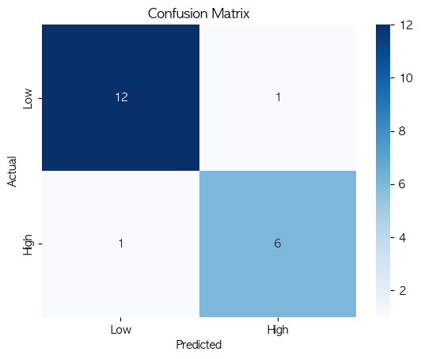
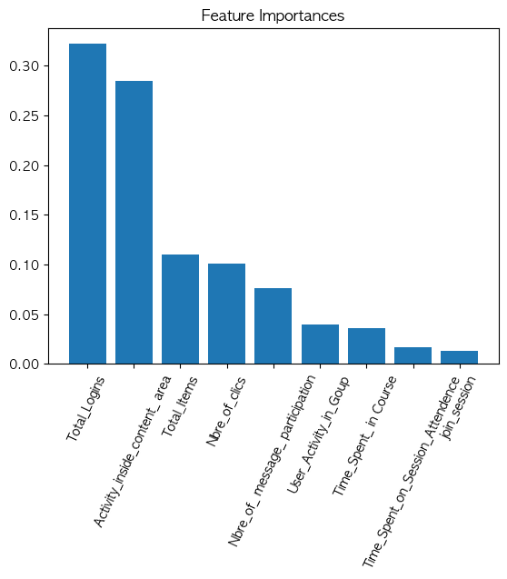

# Student Engagement Prediction

## Paper Reference

-   **Title**: A new ML-based approach to enhance student engagement in online environment
-   **Journal**: PLOS ONE
-   **Link**: [A new ML-based approach to enhance student engagement in online environment](https://journals.plos.org/plosone/article?id=10.1371/journal.pone.0258788)

---

## Objective

Predict **student engagement** levels in an online environment using a machine learning approach.

### Target Variable

-   **`level`**: Represents the engagement of students.
-   Engagement is categorized into:
    -   **Actively Engaged (AE)**
    -   **Passively Engaged (PE)**
    -   **Not Engaged (NE)**

### Engagement Definition for Classification

-   **High Engagement**: AE
-   **Low Engagement**: PE, NE

---

## Methodology

-   **Algorithm Used**: Random Forest Classifier
-   **Evaluation Metrics**:
    -   Accuracy
    -   Recall
    -   Precision
    -   F1 Score
    -   AUC (Area Under the ROC Curve)
-   **Dataset Size**:
    -   Training Data: 80 samples
    -   Test Data: 20 samples

---

## Results

### Model Training Performance (Cross-Validation)

| Metric        | Value  |
| ------------- | ------ |
| **Accuracy**  | 0.9200 |
| **Precision** | 0.9381 |
| **Recall**    | 0.8286 |
| **F1 Score**  | 0.8707 |
| **ROC AUC**   | 0.9780 |

### Model Validation Performance (Test Data)

| Metric        | Value  |
| ------------- | ------ |
| **Accuracy**  | 0.9000 |
| **Precision** | 0.8571 |
| **Recall**    | 0.8571 |
| **F1 Score**  | 0.8571 |
| **AUC**       | 0.9560 |

---

## Visualizations

### Confusion Matrix

### Feature Importances

